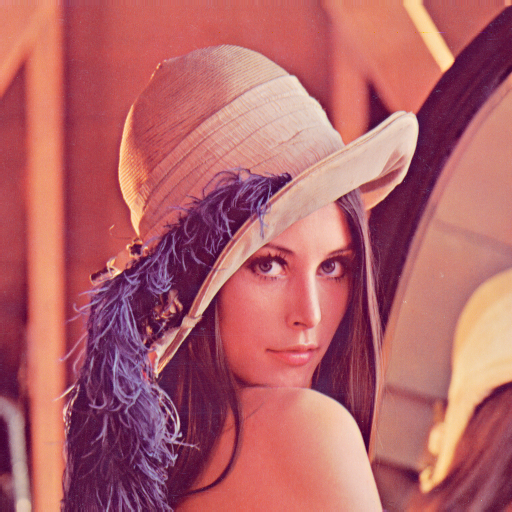
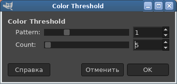
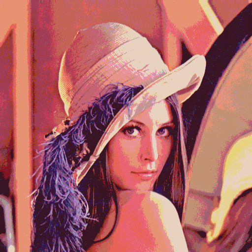

# Gimp plugin Color Threshold

## Description
Include 3 filters:

* Color quant (`== pattern 0`)
* Color bimodal threshold (`== pattern 1`)
* Color dith (Knuth D.E. dither matrix) (`== pattern 2,3,4`)

## Color quant

Convert images to simulate palettes of ancient displays

### The following can be simulated

Launching the plugin `Menu > Colors > Map > Color Threshold...` `== pattern 0`

#### Regular RGB palettes

* 3-bit RGB 2 colors per channel 8 colors in total
* 6-bit RGB 4 colors per channel 64 colors in total
* 9-bit RGB 8 colors per channel 512 colors in total
* 12-bit RGB 16 colors per channel 4,096 colors in total
* 15-bit RGB 32 colors per channel 32,768 colors in total
* 18-bit RGB 64 colors per channel 262,144 colors in total
* change any number of colors per channel 2-256 colors

## Color bimodal threshold

The bimodal threshold is widely used to clean scanned images. This plugin allows you to apply a bimodal threshold to individual parts of the image using the "Color" layer effect.

### Example

Launching the plugin `Menu > Colors > Map > Color Threshold...` `== pattern 1`

Source image:

Plugin dialog:

Result:

## Color dith

Launching the plugin `Menu > Colors > Map > Color Threshold...` `== pattern 2,3,4`  
(Knuth D.E. dither matrix)

## Prerequisites

* [Gimp 2.8](http://www.gimp.org/)

## Installation

* copy `threshold-color` to your `~/.gimp-2.8/plug-ins` directory.

## References

* [ogniewski-scaler](https://github.com/pannacotta98/ogniewski-scaler)
* [http://gimpbook.com/scripting/](http://gimpbook.com/scripting/)
* [http://www.gimp.org/docs/python/index.html](http://www.gimp.org/docs/python/index.html)
